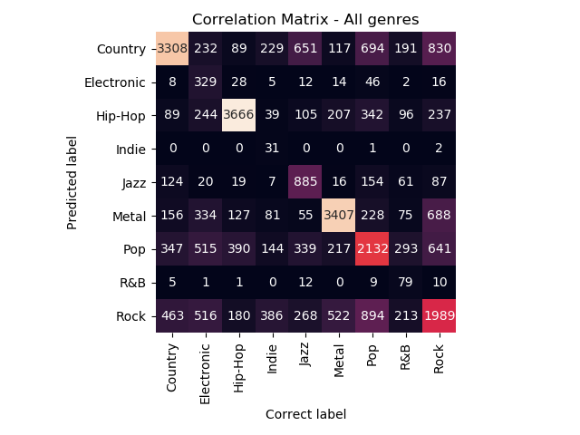
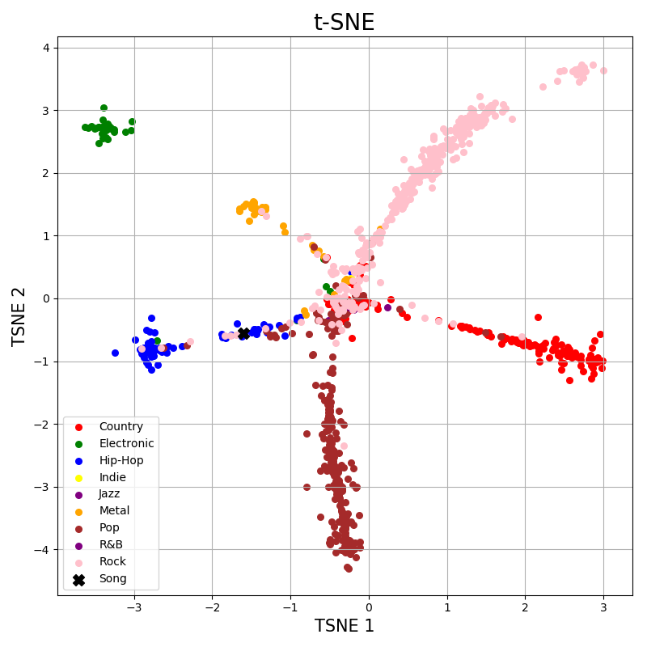

# Song’s Genre prediction based on Lyrics

The idea is to predict the genre of a specific song, based on its lyric and then, provide a playlist for this predicted genre.

## Requirements
- Python 3
- Pandas
- Numpy
- Sklearn
- nltk
- seaborn

## Description

This is a personal project to predict the genre of specific songs thanks to a model previously trained focusing on lyrics

The code use two datasets, the big one focused on training the model ('lyrics.csv'), and the second one and smaller ('songdata.csv'), to predict some genre's outside the dataset training. To facilitate the execution, much of the code has been commented, as in the case of the data cleaning part, with the data available in the respective csv that are loaded throughout the code. You can download the dataset in the the next URL:

https://drive.google.com/file/d/1E4NSo087MvP6DCzVu22BR7Bposc0inLy/view?usp=sharing (Download and extract it in a folder called datasets)

The project is composed by two files, differing in the number of genres included in the training. The first of them ('genre_all.py') has the complete set of genres totalizing 9, while the other ('genre.py') used 5 genres because some of them are very similar to each other, whereby the accuracy of the predictions decreased.

The model shows the probabilities of being part of each genre, and in order to visualize the behaviour of the data, we developed a correlation matrix and a TSNE visualization to test results. Finally, it is offered a playlist for the same predicted genre.

Some visualization examples:

